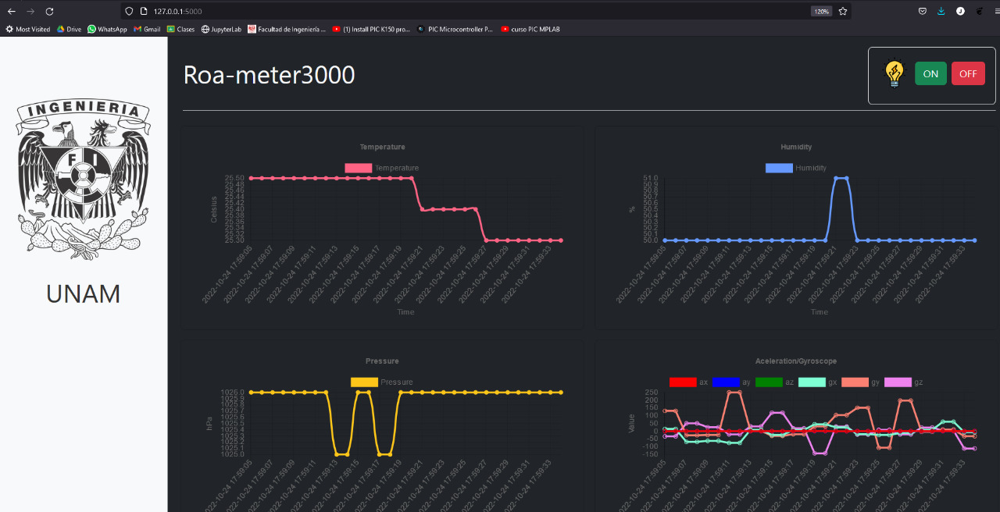

# roa-meter3000
Real-time data aquisition and visualization, as well as control of a led. Implemented with Raspberry Pi Pico (Micropython), Flask, AJAX, and Bootstrap5

In this project I am using 3 sensors, DHT11 for temperature and humidity, MPU6050 as an acelerometer/gyroscope, and BMP180 for atmospheric pressure.
The project consists in a microcrontroller (Pi Pico) for sensing and sending data via serial to the PC, where a webpage is served locally with Flask. In this page is possible to see real-time plots of the measured data and it has a control for a lightbulb. The lightbulb is connected to the microcontroller via a relay, so serial communication has to be bidirectional so we can read whats happening with the buttons ON and OFF in the webpage.

The serial communication is now wireless, the pico sends data with an HC12 module and arduino receives also with an HC12.

